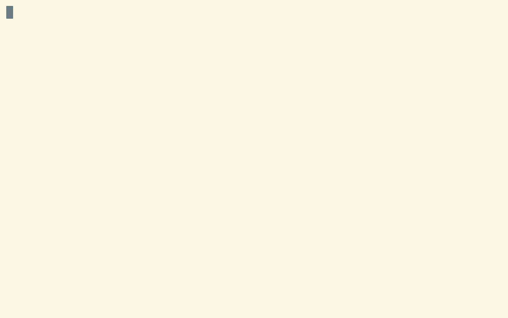

# 🔺 ymc - Yamaha MusicCast CLI



Basic controls for your MusicCast speakers from the terminal.

Features:

- discovery
- power on/off
- switch inputs (🏗)
- volume control

## Installation

### Go

`$ go install github.com/atamanroman/ymc@latest` (🏗)

### Homebrew

TODO

## Usage

```text
RET     Turn on/off
→        Volume up*
←      Volume down*
m       Toggle mute

?         Show help
q              Quit

*Shift: small steps
```

## Build and Run

```sh
🔺 go build -v -o . ./...
🔺 ./ymc
```

or just run

```sh
🔺 go run ./...
```

## Contributing

🏗

## Design

TLDR:

- ymc acts as a UPnP & MusicCast controller
- issues SSDP search to find devices
- queries found UPnP devices to get the YXC API URL and subscribe to status events
- then allows controlling MusicCast devices with the YXC API via CLI

```text
                      (3) GET UPnP description
           (4a) GET device info & status info via YXC API
                  (4b) Subscribe to status changes
                  (5+) Control speaker via YXC API
      ╔══════════════════════════>>>══════════════════════════╗
      ║                                                       ║
      ║                                                       ▼
      ║                                                  ┌─────────┐
  ┌───────┐                          (2) SSDP Search     │         │
  │       │   (1) SSDP Search            Response        │MusicCast│
  │  ymc  │━━━━━━━━━>>>━━━━━━━━━━━━━━━━━━━━<<<━━━━━━━━━━━│ Speaker │
  │       │                                              │         │
  └───────┘                                              └─────────┘
      ▲                                                       │
      │                                                       │
      └───────────────────────────────────────<<<─────────────┘
                                   (6) Send proprietary UDP
                                  messages on status changes

                                                        ─────────  Plain UDP
                                                        ━━━━━━━━━  UPNP (UDP)
                                                        ═════════  HTTP
```

### About UPnP, SSDP and YXC

_Disclaimer: My knowledge of UPnP and the underlying network protocols is pretty limited, but maybe it makes sense to
describe my current understanding briefly._

Yamaha MusicCast speakers are [UPnP (Universal Plug and Play)](https://en.wikipedia.org/wiki/Universal_Plug_and_Play)
devices.
UPnP handles things like discovery, description, control and eventing.
It's built on IP uni-/multicast, UDP higher level protocols
like [SSDP (Simple Service Discovery Protocol)](https://en.wikipedia.org/wiki/Simple_Service_Discovery_Protocol)
and [HTTPU (HTTP)](https://en.wikipedia.org/wiki/Universal_Plug_and_Play#Protocol).

UPnP devices advertise their services on start and then regularly and broadcast events for status changes.

Then the UPnP controller (ymc) fetches the UPnP description from the device to learn what services it has to offer.
ymc only looks for `urn:schemas-upnp-org:device:MediaRenderer:1` devices from manufacturer _Yamaha Corporation_ with
model _MusicCast_.

The UPnP description contains everything needed to control the UPnP services from this device.

MusicCast devices extend the XML `<device>` description with an additional `<yamaha:X_device>` element:

```xml

<yamaha:X_device>
  <yamaha:X_URLBase>http://192.168.178.20:80/</yamaha:X_URLBase>
  <yamaha:X_serviceList>
    <yamaha:X_service>
      <yamaha:X_specType>urn:schemas-yamaha-com:service:X_YamahaRemoteControl:1</yamaha:X_specType>
      <yamaha:X_controlURL>/YamahaRemoteControl/ctrl</yamaha:X_controlURL>
      <yamaha:X_unitDescURL>/YamahaRemoteControl/desc.xml</yamaha:X_unitDescURL>
    </yamaha:X_service>
    <yamaha:X_service>
      <yamaha:X_specType>urn:schemas-yamaha-com:service:X_YamahaExtendedControl:1</yamaha:X_specType>
      <yamaha:X_yxcControlURL>/YamahaExtendedControl/v1/</yamaha:X_yxcControlURL>
      <yamaha:X_yxcVersion>1706</yamaha:X_yxcVersion>
    </yamaha:X_service>
  </yamaha:X_serviceList>
</yamaha:X_device>
```

This is where the MusicCast Controller (like the iOS App) leaves the UPnP track and starts controlling the device with
the YXC (Yamaha Extended Control) HTTP API.
The state of the MusicCast device can be queried and manipulated over YXC.
It also offers a proprietary (?) unicast UDP stream a controller can register itself on to get status updates.

Unfortunately, there seems to be no official source for the YXC spec (which exists in a basic and advanced version).
Different versions of the PDFs are available though and reverse engineering the HTTP API (very not-RESTful) is easy
enough.
And there's a lot of OSS sample code on GitHub
like [Yamaha MusicCast Binding](https://github.com/coop-git/YamahaMusicCast).

This is enough to build a simple CLI controller which can search for devices and manipulate power, inputs and volume.

Advanced MusicCast features like zones and linking are (as of today) out of scope since I

- don't use those features regularly and can always fall back to the app.
- do not own an MusicCast enabled AV receiver, which seems to be required for zones.

There's also the Yamaha Remote Control API (
see [tryptophane/yamaha-remote](https://github.com/tryptophane/yamaha-remote)).
The `/YamahaRemoteControl/desc.xml` file gives 404 on my speakers, though.
Could be only enabled on AV receivers, but then it's strange that they advertise the service.

My references:

- sniffing on the MusicCast device and iOS App traffic
- *Yamaha_Extended_Control_API_Specification_(Basic).pdf*
- [UPnP-arch-DeviceArchitecture-v2.0.pdf](https://openconnectivity.org/upnp-specs/UPnP-arch-DeviceArchitecture-v2.0-20200417.pdf)

### Packages

- `ymc/musiccast`
  - code for the YXC API
  - subscribes and listens to YXC UDP events
  - publishes `Speaker` updates via channel
- `ymc/internal/ssdp` (based on koron/go-ssd - see [Disclaimer](#disclaimer))
  - handles SSDP via UDP multicast
  - does SSDP service discovery to make the speakers visible
  - publishes SSDP `Service` events *only* from Yamaha MusicCast devices via channel

## FAQ

Q: Why _"ymc"_? \
A: **Y**amaha **M**usicCast **C**LI

Q: Why Go? \
A: Easy to build a cross-platform binary and I like the simplicity.

Q: Why modify the [koron/go-ssdp](https://github.com/koron/go-ssdp) code and not use it as-is? \
A: I wanted to publish discovered services via channel, which is not how their API works.
And it seems I'm not clever enough to do SSDP/UDP multicast from scratch.

## Disclaimer

This repository is not affiliated with Yamaha Corporation.

Most of the UDP multicast code is copied and then altered from [koron/go-ssdp](https://github.com/koron/go-ssdp).

See [LICENSE-3RD-PARTY](./LICENSE-THIRD-PARTY) for licensing details.

Use on your own risk.
